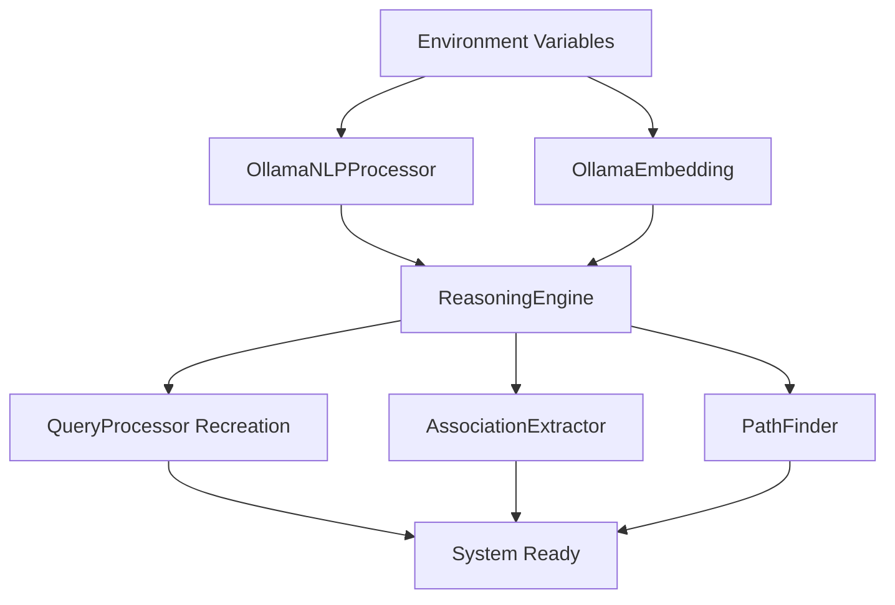

# Component Initialization Order Guidelines

**Version**: 1.0  
**Status**: ✅ **ENFORCED**  
**Criticality**: **MANDATORY** for all hybrid services  

## 🎯 Purpose

This document establishes **mandatory initialization order requirements** to prevent critical system failures related to embedding processor configuration and component dependencies.

**Background**: A critical system failure (2025-10-20) was caused by incorrect initialization order in hybrid services, leading to broken reasoning paths and semantic search failures. This document prevents regression.

## 🚨 Critical Rules

### Rule 1: Embedding Processor First
**MANDATORY**: Embedding processors MUST be created BEFORE any components that depend on them.

```python
# ✅ CORRECT ORDER
def __init__(self):
    # 1. Create embedding processors FIRST
    self.ollama_nlp = OllamaNLPProcessor(model_name="nomic-embed-text")
    
    # 2. Initialize dependent components
    self._core = ReasoningEngine(use_rust_storage=True)
    
    # 3. Reconstruct dependent components if needed
    self._core.query_processor = QueryProcessor(
        storage=self._core.storage,
        nlp_processor=self.ollama_nlp,  # ← Use pre-created processor
    )
```

### Rule 2: Single Model Consistency
**MANDATORY**: All embedding-related components MUST use the same model (nomic-embed-text).

```python
# ✅ CORRECT: Single model
model_name = "nomic-embed-text"
ollama_nlp = OllamaNLPProcessor(model_name=model_name)
ollama_embedding = OllamaEmbedding(model_name=model_name)

# ❌ FORBIDDEN: Mixed models
ollama_nlp = OllamaNLPProcessor(model_name="nomic-embed-text")        # 768-d
spacy_nlp = TextProcessor()  # Different embedding space - FORBIDDEN
```

### Rule 3: No Fallback Chains
**MANDATORY**: No fallback chains between different embedding models/processors.

```python
# ❌ FORBIDDEN: Fallback chains
if embedding_processor_a is None:
    if nlp_processor_b is None:
        fallback_to_different_model()  # ← BREAKS SEMANTIC CONSISTENCY

# ✅ CORRECT: Single path validation
if not self.ollama_nlp:
    raise RuntimeError("PRODUCTION FAILURE: nomic-embed-text processor required")
```

## 🏗️ Component Dependency Hierarchy



### Initialization Phases

#### Phase 1: Environment Setup
```python
# Validate environment
model_name = os.getenv("SUTRA_EMBEDDING_MODEL", "nomic-embed-text")
if model_name != "nomic-embed-text":
    raise ValueError("Only nomic-embed-text supported")

os.environ["SUTRA_STORAGE_MODE"] = "server"  
os.environ["SUTRA_STORAGE_SERVER"] = storage_server
```

#### Phase 2: Embedding Processor Creation
```python
# Create embedding processors FIRST
try:
    self.ollama_nlp = OllamaNLPProcessor(model_name=model_name)
    logger.info("✅ Created OllamaNLPProcessor")
except Exception as e:
    raise RuntimeError(f"CRITICAL: Cannot create embedding processor: {e}")
```

#### Phase 3: Core Component Initialization  
```python
# Initialize components that create sub-components
self._core = ReasoningEngine(use_rust_storage=True)
logger.info("ReasoningEngine initialized")
```

#### Phase 4: Component Reconstruction
```python
# Recreate components that need specific processors
self._core.query_processor = QueryProcessor(
    self._core.storage,
    self._core.association_extractor, 
    self._core.path_finder,
    self._core.mppa,
    embedding_processor=None,
    nlp_processor=self.ollama_nlp,  # ← Use pre-created processor
)
logger.info("QueryProcessor recreated with correct NLP processor")
```

## 🛠️ Service-Specific Guidelines

### Hybrid Service (sutra-hybrid)

**File**: `packages/sutra-hybrid/sutra_hybrid/engine.py`

**Requirements**:
1. OllamaNLPProcessor created in `__init__()` before ReasoningEngine
2. QueryProcessor recreated after ReasoningEngine initialization
3. All embedding operations use same nomic-embed-text model

**Template**:
```python
class SutraAI:
    def __init__(self, storage_server: str = "storage-server:50051"):
        # Phase 1: Environment
        os.environ["SUTRA_STORAGE_MODE"] = "server"
        os.environ["SUTRA_STORAGE_SERVER"] = storage_server
        
        # Phase 2: Embedding processors FIRST
        model_name = os.getenv("SUTRA_EMBEDDING_MODEL", "nomic-embed-text")
        self.ollama_nlp = OllamaNLPProcessor(model_name=model_name)
        
        # Phase 3: Core components
        self._core = ReasoningEngine(use_rust_storage=True)
        
        # Phase 4: Component reconstruction
        self._core.query_processor = QueryProcessor(
            self._core.storage,
            self._core.association_extractor,
            self._core.path_finder, 
            self._core.mppa,
            embedding_processor=None,
            nlp_processor=self.ollama_nlp,
        )
        
        # Phase 5: Additional components
        self._embedding_provider = self._init_embeddings(enable_semantic=True)
```

### API Service (sutra-api)

**File**: `packages/sutra-api/sutra_api/main.py`

**Requirements**:
1. Must validate storage server has embedding capability
2. Must not create embedding processors (delegates to storage)
3. Must validate reasoning paths are working

### Storage Server (sutra-storage)

**Requirements**:
1. Must have nomic-embed-text model loaded
2. Must provide embedding generation via unified learning pipeline  
3. Must maintain 768-dimensional vector consistency

## 🔍 Validation Requirements

### Startup Validation
Every service MUST validate embedding capability at startup:

```python
def validate_embedding_capability(self):
    """MANDATORY: Validate embedding capability at startup."""
    try:
        # Test embedding generation
        test_embedding = self.ollama_nlp.get_embedding("test")
        assert test_embedding is not None
        assert len(test_embedding) == 768
        logger.info("✅ Embedding capability validated")
    except Exception as e:
        raise RuntimeError(f"CRITICAL: Embedding validation failed: {e}")
```

### Runtime Validation
```python  
def validate_query_capability(self):
    """MANDATORY: Validate query processing capability."""
    try:
        # Test query processing
        result = self.query_processor.process_query("test query")
        assert result is not None
        logger.info("✅ Query processing capability validated")
    except Exception as e:
        raise RuntimeError(f"CRITICAL: Query processing validation failed: {e}")
```

## 🚨 Anti-Patterns (Forbidden)

### ❌ Late Processor Creation
```python
# FORBIDDEN: Creating processors after components that need them
def __init__(self):
    self.reasoning_engine = ReasoningEngine()  # ← Creates QueryProcessor first
    self.embedding_processor = OllamaNLPProcessor()  # ← Too late!
```

### ❌ Mixed Embedding Models
```python  
# FORBIDDEN: Using different models for different components
self.learning_embedding = OllamaEmbedding("nomic-embed-text")  # 768-d
self.query_embedding = SpacyProcessor()  # Different space - BREAKS SYSTEM
```

### ❌ Fallback Chains
```python
# FORBIDDEN: Fallback chains between different models
if not self.ollama_processor:
    if not self.sentence_transformer:
        self.fallback_processor = SpacyProcessor()  # ← Semantic space corruption
```

### ❌ Silent Failures
```python
# FORBIDDEN: Silent failures that leave components non-functional
try:
    self.embedding_processor = OllamaNLPProcessor()
except Exception:
    pass  # ← Leaves system broken, should FAIL FAST
```

## 📋 Implementation Checklist

### New Service Creation
- [ ] Environment validation first
- [ ] Embedding processors created before dependent components  
- [ ] Single nomic-embed-text model used throughout
- [ ] Component reconstruction after core initialization
- [ ] Startup validation of embedding capability
- [ ] Runtime validation of query processing  
- [ ] Proper error handling with fail-fast behavior
- [ ] Logging of initialization phases

### Existing Service Updates
- [ ] Review initialization order against guidelines
- [ ] Identify late processor creation patterns
- [ ] Fix component reconstruction where needed
- [ ] Add validation methods
- [ ] Update error handling
- [ ] Test with clean deployment

## 🔧 Testing Requirements

### Unit Tests
```python
def test_initialization_order(self):
    """Test correct initialization order."""
    service = SutraAI()
    
    # Verify embedding processor exists
    assert service.ollama_nlp is not None
    
    # Verify QueryProcessor has correct processor
    assert service._core.query_processor.nlp_processor is not None
    assert service._core.query_processor.nlp_processor == service.ollama_nlp
```

### Integration Tests
```python  
def test_end_to_end_reasoning(self):
    """Test complete reasoning pipeline."""
    service = SutraAI()
    
    # Test query processing
    result = service.ask("What is the tallest mountain?")
    
    # Verify semantic support exists (embeddings working)
    assert hasattr(result, 'semantic_support')
    assert len(result.semantic_support) > 0
```

## 📚 References

- [Technical Debt Resolution](./TECHNICAL_DEBT_REASONING_PATHS_RESOLVED.md) - Root cause analysis
- [Production Requirements](../PRODUCTION_REQUIREMENTS.md) - Embedding model requirements
- [Embedding Troubleshooting](./EMBEDDING_TROUBLESHOOTING.md) - Common issues and fixes

---

**Compliance**: **MANDATORY** for all services  
**Review**: Required for all component initialization code  
**Enforcement**: Automated testing and manual review process