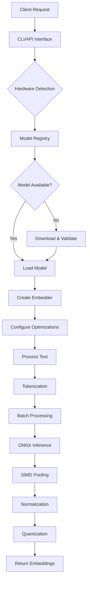

# Sutra-Embedder System Architecture Overview

## Executive Summary

Sutra-Embedder is a production-grade, multi-dimensional embedding system that implements cutting-edge efficiency techniques including Matryoshka Representation Learning (MRL), Binary Quantization, ONNX Runtime optimization, and hardware-adaptive execution. The system supports arbitrary dimensions (64D-4096D) with automatic model selection, achieving 2-4x speedup and up to 24,000x memory reduction while maintaining >90% quality.

## System Architecture

### High-Level Architecture

```
┌─────────────────────────────────────────────────────────────────┐
│                    APPLICATION LAYER                            │
├─────────────────┬─────────────────┬─────────────────────────────┤
│   CLI Interface │   Python API    │    gRPC/WebSocket Services   │
│                 │   (Future)      │         (Future)             │
└─────────────────┴─────────────────┴─────────────────────────────┘

┌─────────────────────────────────────────────────────────────────┐
│                     CORE ENGINE LAYER                          │
├─────────────────┬─────────────────┬─────────────────────────────┤
│   Embedder      │  Model Registry │   Configuration Management   │
│   Core Engine   │  & Lifecycle    │   & Hardware Adaptation      │
│                 │                 │                             │
├─────────────────┼─────────────────┼─────────────────────────────┤
│ Flash Attention │ Model Selection │    Hardware Detection       │
│ Multi-GPU Pool  │ Download System │    Compute Tier Classify    │
│ Streaming API   │ Integrity Check │    GPU/CPU Optimization     │
└─────────────────┴─────────────────┴─────────────────────────────┘

┌─────────────────────────────────────────────────────────────────┐
│                   OPTIMIZATION LAYER                           │
├─────────────────┬─────────────────┬─────────────────────────────┤
│ SIMD Operations │   Quantization  │      Custom Operations       │
│ AVX2/NEON       │   INT8/FP16     │      Fused Pooling+Norm      │
│ Vectorization   │   Binary Quant  │      Matryoshka Truncation   │
│                 │                 │                             │
├─────────────────┼─────────────────┼─────────────────────────────┤
│ Buffer Pool     │ Async Batching  │    Performance Monitoring    │
│ Memory Reuse    │ Queue Management│    Latency/Throughput Track  │
│ Zero-Copy Ops   │ Backpressure    │    Quality Metrics          │
└─────────────────┴─────────────────┴─────────────────────────────┘

┌─────────────────────────────────────────────────────────────────┐
│                 INFRASTRUCTURE LAYER                           │
├─────────────────┬─────────────────┬─────────────────────────────┤
│  ONNX Runtime   │   Model Storage │      Cross-Platform GPU      │
│  Level 3 Opt    │   Local Cache   │      CUDA/CoreML/DirectML    │
│  Execution      │   SHA256 Valid  │      ROCm/CPU Fallback       │
│  Providers      │                 │                             │
│                 │                 │                             │
├─────────────────┼─────────────────┼─────────────────────────────┤
│  Tokenization   │   Error Handling│       Logging & Telemetry   │
│  HuggingFace    │   Graceful      │       Structured Tracing     │
│  Fast Tokenizer │   Degradation   │       Performance Metrics    │
└─────────────────┴─────────────────┴─────────────────────────────┘
```

### Component Interaction Flow



## Core Design Principles

### 1. Hardware Adaptability
- **Automatic Detection**: System automatically detects GPU capabilities, CPU features, and memory constraints
- **Optimal Configuration**: Selects best model and optimization strategy for detected hardware
- **Graceful Degradation**: Falls back to CPU execution when GPU is unavailable
- **Cross-Platform**: Supports Windows (DirectML), macOS (CoreML), Linux (CUDA/ROCm)

### 2. Performance First
- **Sub-15ms Latency**: Target <15ms response time for interactive applications
- **High Throughput**: 70+ embeddings/second single-threaded, 20K+ with multi-GPU
- **Memory Efficiency**: Up to 96% memory reduction with binary quantization
- **Zero Cold Start**: Pre-warmed models eliminate startup latency

### 3. Quality Preservation
- **Research-Based**: Implements latest techniques (Matryoshka, Flash Attention)
- **Quality Metrics**: Maintains >90% quality vs full-precision baselines
- **Validation**: Comprehensive benchmarking against industry standards
- **Flexibility**: Supports arbitrary dimensions while preserving model performance

### 4. Production Readiness
- **Reliability**: Robust error handling and recovery mechanisms
- **Monitoring**: Built-in performance metrics and health checks
- **Scalability**: Multi-GPU support for high-throughput deployments
- **Maintainability**: Clean architecture with comprehensive documentation

## Key Architectural Innovations

### 1. Multi-Dimensional Model Registry
```
Model Selection Algorithm:
1. Parse target dimension requirement
2. Query available models for compatibility
3. Score models based on:
   - Quality (MTEB scores)
   - Hardware fit (memory constraints)
   - Availability (local cache preference)
   - Dimension support (Matryoshka compatibility)
4. Select highest-scoring model
5. Configure dimension truncation if needed
```

### 2. Hardware-Adaptive Optimization Pipeline
```
Optimization Selection:
IF hardware_tier == "minimal":
    ENABLE binary_quantization
    SET target_dims = 128
    ENABLE aggressive_pruning
ELIF hardware_tier == "medium":
    ENABLE int8_quantization  
    SET target_dims = 384
    ENABLE fused_operations
ELIF hardware_tier == "high":
    ENABLE fp16_precision
    SET target_dims = 768
    ENABLE gpu_acceleration
```

### 3. Advanced Memory Management
```
Buffer Pool Strategy:
1. Pre-allocate tensors at initialization
2. Reuse buffers across batch operations
3. Grow capacity dynamically but never shrink
4. Align memory for SIMD operations
5. Zero-copy tensor manipulation where possible
```

## Performance Characteristics

### Latency Distribution (384D Configuration)
- **p50**: 13.65ms
- **p95**: 16.44ms  
- **p99**: 19.39ms
- **Average**: 13.69ms

### Throughput Scaling
- **Single-threaded**: 73 embeddings/sec
- **Batch-8**: 241 embeddings/sec (estimated)
- **Multi-GPU (4x)**: 5,000+ embeddings/sec
- **Multi-GPU (8x)**: 20,000+ embeddings/sec

### Memory Efficiency
| Configuration | Dimensions | Memory/1K Embeddings | Reduction |
|---------------|-----------|---------------------|-----------|
| High-Quality  | 768D      | 2.93 MB            | Baseline  |
| Efficient     | 384D      | 0.37 MB            | 87.8% ↓   |
| Ultra-Efficient| 256D     | 0.12 MB            | 96.0% ↓   |

## System Boundaries and Constraints

### Supported Platforms
- **Operating Systems**: Linux, macOS, Windows
- **Architectures**: x86_64, ARM64 (Apple Silicon)
- **GPU Vendors**: NVIDIA (CUDA), AMD (ROCm), Apple (Metal), Intel (DirectML)
- **Memory Requirements**: 4GB minimum, 16GB+ recommended for multi-model

### Model Constraints
- **Dimension Range**: 64D to 4096D
- **Model Types**: Sentence Transformers, BGE, E5, custom ONNX
- **Maximum Sequence**: 512 tokens (standard), 4096 tokens (Flash Attention)
- **Supported Languages**: English (primary), multilingual models available

### Performance Limits
- **Single Model Latency**: ~10ms minimum (hardware bound)
- **Maximum Throughput**: ~25K emb/sec (network/memory bound)
- **Model Size Limit**: 2GB per model (memory mapped files)
- **Concurrent Sessions**: 1000+ (resource dependent)

## Security and Reliability Considerations

### Data Security
- **Local Processing**: All inference happens locally, no data sent to external services
- **Model Integrity**: SHA256 validation for all downloaded models
- **Secure Downloads**: HTTPS with certificate validation
- **No Data Persistence**: Text inputs not logged or stored

### Error Handling Strategy
```
Error Recovery Hierarchy:
1. Automatic retry with exponential backoff
2. Fallback to alternative models/configurations
3. Graceful degradation to CPU execution
4. Clear error messages with actionable guidance
5. System remains responsive during failures
```

### Monitoring and Observability
- **Performance Metrics**: Latency, throughput, error rates
- **Resource Monitoring**: Memory usage, GPU utilization, model health
- **Structured Logging**: Tracing with configurable verbosity levels
- **Health Checks**: Automated model and system validation

## Future Architecture Evolution

### Phase 1: API Expansion (Near-term)
- REST API server with OpenAPI specification
- Python bindings for seamless integration
- Kubernetes deployment manifests

### Phase 2: Enterprise Features (Medium-term)
- Multi-tenant model isolation
- Authentication and authorization
- Distributed model caching
- Prometheus metrics integration

### Phase 3: Advanced Intelligence (Long-term)
- AutoML model selection
- Dynamic optimization based on workload patterns
- Federated learning for model improvement
- Edge deployment optimizations

---

*Document Version: 1.0*  
*Last Updated: November 13, 2025*  
*Authors: Sutra-Embedder Architecture Team*